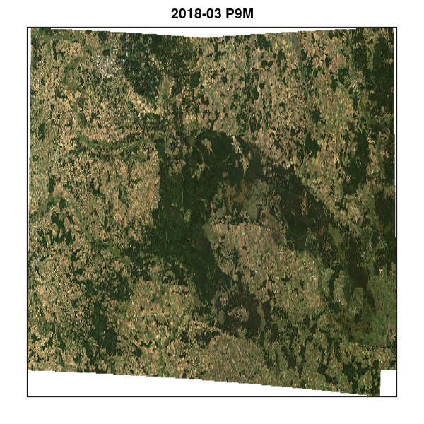
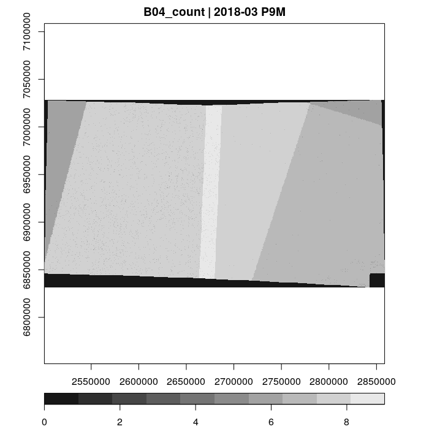
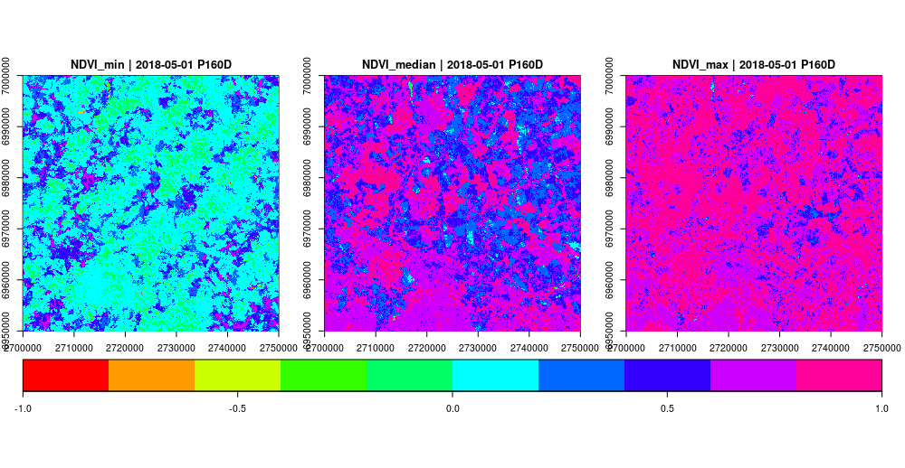
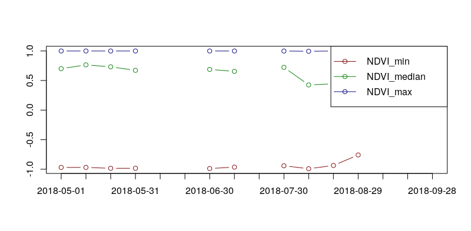
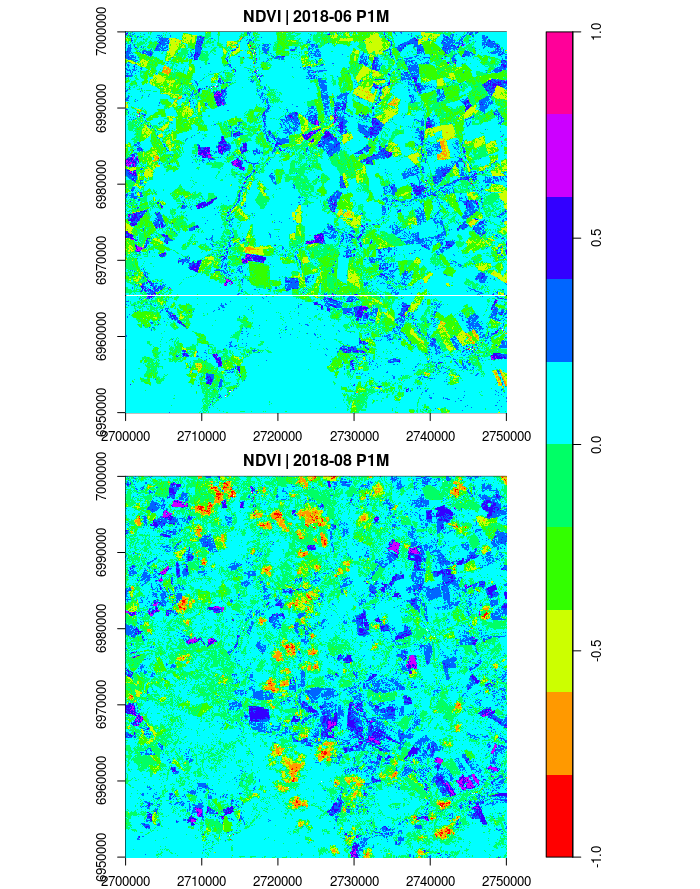
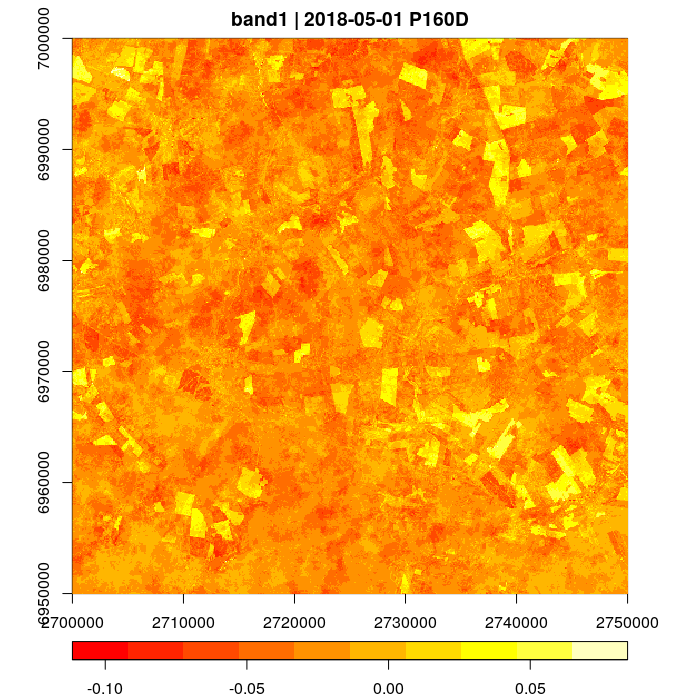

## Preface

This tutorial will demonstrate how Sentinel 2 image time series can be processed
with the gdalcubes R package. We will use 102 Sentinel 2 Level 2A images
from three different tiles, covering the European [Białowieża Forest](https://en.wikipedia.org/wiki/Bia%C5%82owie%C5%BCa_Forest) from
March to November 2018.


We assume that you have successfully installed the R package. If not, please 
follow the instructions at [GitHub](https://github.com/appelmar/gdalcubes_R).
Due to the data size, we do not provide the data along with this document. However,
you should be able to run the commands by downloading the same data from the [Copernicus Open Access Hub](https://scihub.copernicus.eu/) on your own, 
or by putting any other Sentinel 2 Level 2A(!) images to the current working directory.

Time measurements refer to a personal laptop equipped with a quite powerful quad-core CPU where images are stored on an SSD and up to 8 threads are used to process the data cubes. 

## Getting started

As a first step, we load the package with `library(gdalcubes)`, which also loads required packages and prints some version information. 

```
library(gdalcubes)
## Loading required package: Rcpp
## Loading required package: RcppProgress
## Loading required package: jsonlite
## Loading required package: ncdf4
## Using gdalcubes library version 0.0.1 (e2b3e14f94ec0bc3687afc845c21a3c68ce7a36c)
```

The Sentinel 2 images are stored as original ZIP archives at the current working directory.
We process the archive files directly without unzipping through [GDAL's virtual file system vsizip](https://www.gdal.org/gdal_virtual_file_systems.html#gdal_virtual_file_systems_vsizip).
The following command prints a list of available files.

```
list.files(pattern=".zip")
##  [1] "S2A_MSIL2A_20180328T093031_N0207_R136_T34UFD_20180328T145945.zip" "S2A_MSIL2A_20180407T093031_N0207_R136_T34UFD_20180407T104459.zip"
##  [3] "S2A_MSIL2A_20180407T093031_N0207_R136_T34UGD_20180407T104459.zip" "S2A_MSIL2A_20180407T093031_N0207_R136_T35ULU_20180407T104459.zip"
##  [5] "S2A_MSIL2A_20180410T094031_N0207_R036_T34UFD_20180410T114924.zip" "S2A_MSIL2A_20180410T094031_N0207_R036_T34UGD_20180410T114924.zip"
##  [7] "S2A_MSIL2A_20180410T094031_N0207_R036_T35ULU_20180410T114924.zip" "S2A_MSIL2A_20180420T094031_N0207_R036_T34UFD_20180420T101451.zip"
##  [9] "S2A_MSIL2A_20180420T094031_N0207_R036_T34UGD_20180420T101451.zip" "S2A_MSIL2A_20180420T094031_N0207_R036_T35ULU_20180420T101451.zip"
## [11] "S2A_MSIL2A_20180430T094031_N0207_R036_T34UFD_20180430T114456.zip" "S2A_MSIL2A_20180430T094031_N0207_R036_T34UFD_20180430T132616.zip"
## [13] "S2A_MSIL2A_20180430T094031_N0207_R036_T34UGD_20180430T114456.zip" "S2A_MSIL2A_20180430T094031_N0207_R036_T35ULU_20180430T114456.zip"
## [15] "S2A_MSIL2A_20180430T094031_N0207_R036_T35ULU_20180430T132616.zip" "S2A_MSIL2A_20180507T093041_N0207_R136_T34UFD_20180507T114155.zip"
## [17] "S2A_MSIL2A_20180507T093041_N0207_R136_T34UGD_20180507T114155.zip" "S2A_MSIL2A_20180507T093041_N0207_R136_T35ULU_20180507T114155.zip"
## [19] "S2A_MSIL2A_20180510T094031_N0207_R036_T34UFD_20180510T114819.zip" "S2A_MSIL2A_20180510T094031_N0207_R036_T34UGD_20180510T114819.zip"
## [21] "S2A_MSIL2A_20180510T094031_N0207_R036_T35ULU_20180510T114819.zip" "S2A_MSIL2A_20180520T094031_N0207_R036_T34UFD_20180520T100921.zip"
## [23] "S2A_MSIL2A_20180520T094031_N0207_R036_T34UGD_20180520T100921.zip" "S2A_MSIL2A_20180520T094031_N0207_R036_T35ULU_20180520T100921.zip"
## [25] "S2A_MSIL2A_20180527T093041_N0208_R136_T34UFD_20180527T121043.zip" "S2A_MSIL2A_20180527T093041_N0208_R136_T34UGD_20180527T121043.zip"
## [27] "S2A_MSIL2A_20180527T093041_N0208_R136_T35ULU_20180527T121043.zip" "S2A_MSIL2A_20180530T094031_N0208_R036_T34UFD_20180530T122531.zip"
## [29] "S2A_MSIL2A_20180530T094031_N0208_R036_T34UGD_20180530T122531.zip" "S2A_MSIL2A_20180530T094031_N0208_R036_T35ULU_20180530T122531.zip"
## [31] "S2A_MSIL2A_20180606T093031_N0208_R136_T34UFD_20180606T140856.zip" "S2A_MSIL2A_20180609T094031_N0208_R036_T34UFD_20180609T111936.zip"
## [33] "S2A_MSIL2A_20180609T094031_N0208_R036_T34UGD_20180609T111936.zip" "S2A_MSIL2A_20180609T094031_N0208_R036_T35ULU_20180609T111936.zip"
## [35] "S2A_MSIL2A_20180629T094031_N0208_R036_T34UFD_20180629T121612.zip" "S2A_MSIL2A_20180706T093041_N0208_R136_T34UFD_20180706T121907.zip"
## [37] "S2A_MSIL2A_20180706T093041_N0208_R136_T34UGD_20180706T121907.zip" "S2A_MSIL2A_20180706T093041_N0208_R136_T35ULU_20180706T121907.zip"
## [39] "S2A_MSIL2A_20180709T094031_N0208_R036_T34UFD_20180709T121340.zip" "S2A_MSIL2A_20180709T094031_N0208_R036_T34UFD_20180709T122246.zip"
## [41] "S2A_MSIL2A_20180719T094031_N0208_R036_T34UFD_20180719T123605.zip" "S2A_MSIL2A_20180719T094031_N0208_R036_T34UGD_20180719T123605.zip"
## [43] "S2A_MSIL2A_20180719T094031_N0208_R036_T35ULU_20180719T123605.zip" "S2A_MSIL2A_20180808T094031_N0208_R036_T34UFD_20180808T123512.zip"
## [45] "S2A_MSIL2A_20180808T094031_N0208_R036_T34UGD_20180808T123512.zip" "S2A_MSIL2A_20180808T094031_N0208_R036_T35ULU_20180808T123512.zip"
## [47] "S2A_MSIL2A_20180818T094031_N0208_R036_T34UFD_20180818T120345.zip" "S2A_MSIL2A_20180818T094031_N0208_R036_T34UGD_20180818T120345.zip"
## [49] "S2A_MSIL2A_20180818T094031_N0208_R036_T35ULU_20180818T120345.zip" "S2A_MSIL2A_20181014T093031_N0209_R136_T34UFD_20181014T111722.zip"
## [51] "S2A_MSIL2A_20181014T093031_N0209_R136_T34UGD_20181014T111722.zip" "S2A_MSIL2A_20181014T093031_N0209_R136_T35ULU_20181014T111722.zip"
## [53] "S2A_MSIL2A_20181017T094011_N0209_R036_T34UFD_20181017T115053.zip" "S2A_MSIL2A_20181017T094011_N0209_R036_T34UGD_20181017T115053.zip"
## [55] "S2A_MSIL2A_20181017T094011_N0209_R036_T35ULU_20181017T115053.zip" "S2B_MSIL2A_20180326T094029_N0207_R036_T34UGD_20180326T114246.zip"
## [57] "S2B_MSIL2A_20180326T094029_N0207_R036_T35ULU_20180326T114246.zip" "S2B_MSIL2A_20180412T093029_N0207_R136_T34UFD_20180412T122815.zip"
## [59] "S2B_MSIL2A_20180412T093029_N0207_R136_T34UGD_20180412T122815.zip" "S2B_MSIL2A_20180412T093029_N0207_R136_T35ULU_20180412T122815.zip"
## [61] "S2B_MSIL2A_20180505T094029_N0207_R036_T34UGD_20180505T115132.zip" "S2B_MSIL2A_20180505T094029_N0207_R036_T35ULU_20180505T115132.zip"
## [63] "S2B_MSIL2A_20180512T093029_N0207_R136_T34UFD_20180512T131132.zip" "S2B_MSIL2A_20180512T093029_N0207_R136_T34UGD_20180512T131132.zip"
## [65] "S2B_MSIL2A_20180512T093029_N0207_R136_T35ULU_20180512T131132.zip" "S2B_MSIL2A_20180515T094029_N0207_R036_T34UFD_20180515T114639.zip"
## [67] "S2B_MSIL2A_20180515T094029_N0207_R036_T34UGD_20180515T114639.zip" "S2B_MSIL2A_20180515T094029_N0207_R036_T35ULU_20180515T114639.zip"
## [69] "S2B_MSIL2A_20180522T093029_N0207_R136_T34UFD_20180522T121543.zip" "S2B_MSIL2A_20180601T093029_N0208_R136_T34UFD_20180601T111648.zip"
## [71] "S2B_MSIL2A_20180601T093029_N0208_R136_T34UGD_20180601T111648.zip" "S2B_MSIL2A_20180601T093029_N0208_R136_T35ULU_20180601T111648.zip"
## [73] "S2B_MSIL2A_20180604T094029_N0208_R036_T34UFD_20180604T135858.zip" "S2B_MSIL2A_20180604T094029_N0208_R036_T34UGD_20180604T135858.zip"
## [75] "S2B_MSIL2A_20180604T094029_N0208_R036_T35ULU_20180604T135858.zip" "S2B_MSIL2A_20180731T093029_N0208_R136_T34UGD_20180731T120012.zip"
## [77] "S2B_MSIL2A_20180731T093029_N0208_R136_T35ULU_20180731T120012.zip" "S2B_MSIL2A_20180803T094029_N0208_R036_T34UFD_20180803T141742.zip"
## [79] "S2B_MSIL2A_20180810T093029_N0208_R136_T34UFD_20180810T121904.zip" "S2B_MSIL2A_20180810T093029_N0208_R136_T34UGD_20180810T121904.zip"
## [81] "S2B_MSIL2A_20180810T093029_N0208_R136_T35ULU_20180810T121904.zip" "S2B_MSIL2A_20180813T094029_N0208_R036_T34UGD_20180813T152841.zip"
## [83] "S2B_MSIL2A_20180813T094029_N0208_R036_T35ULU_20180813T152841.zip" "S2B_MSIL2A_20180820T093029_N0208_R136_T34UFD_20180820T120528.zip"
## [85] "S2B_MSIL2A_20180820T093029_N0208_R136_T34UGD_20180820T120528.zip" "S2B_MSIL2A_20180820T093029_N0208_R136_T35ULU_20180820T120528.zip"
## [87] "S2B_MSIL2A_20180823T094029_N0208_R036_T34UFD_20180823T122014.zip" "S2B_MSIL2A_20180823T094029_N0208_R036_T34UGD_20180823T122014.zip"
## [89] "S2B_MSIL2A_20180823T094029_N0208_R036_T35ULU_20180823T122014.zip" "S2B_MSIL2A_20180830T093029_N0208_R136_T34UFD_20180830T120453.zip"
## [91] "S2B_MSIL2A_20180830T093029_N0208_R136_T34UGD_20180830T120453.zip" "S2B_MSIL2A_20180830T093029_N0208_R136_T35ULU_20180830T120453.zip"
## [93] "S2B_MSIL2A_20180929T093029_N0208_R136_T34UFD_20180929T140703.zip" "S2B_MSIL2A_20181009T093029_N0209_R136_T34UGD_20181009T122235.zip"
## [95] "S2B_MSIL2A_20181009T093029_N0209_R136_T35ULU_20181009T122235.zip" "S2B_MSIL2A_20181012T094029_N0209_R036_T34UFD_20181012T145646.zip"
## [97] "S2B_MSIL2A_20181012T094029_N0209_R036_T34UGD_20181012T145646.zip" "S2B_MSIL2A_20181012T094029_N0209_R036_T35ULU_20181012T145646.zip"
## [99] "S2B_MSIL2A_20181019T093029_N0209_R136_T34UGD_20181019T123600.zip" "S2B_MSIL2A_20181019T093029_N0209_R136_T35ULU_20181019T123600.zip"
##[101] "S2B_MSIL2A_20181108T093209_N0210_R136_T34UGD_20181108T125929.zip" "S2B_MSIL2A_20181108T093209_N0210_R136_T35ULU_20181108T125929.zip"
```

This gives us 102 images, amounting to approximately 90 GB.

```
sum(file.size(list.files(pattern="*.zip"))) / 1000^3
## [1] 90.2587
```

As described above, the data come from 3 different tiles (T34UFD, T34UGD, and T35ULU) covering two different UTM Zones (34N and 35N). Images also come from both 
operating satellites S2A and S2B.


## Creating an image collection from local files


Before creating a data cube, we must index the files in an _image collection_ by deriving the aquisition date / time, the spatial extent, the spatial reference system,
and which files belong to which spectral bands. This is what `create_image_collection()` does. We provide a vector of files, a _collection format_ that defines
how the information above can be extracted from images, and an output file, where the image collection index shall be stored. The output file is 
a simple [SQLite](https://www.sqlite.org) database referencing the provided files and the extracted metadata.  Notice that gdalcubes comes with a set of predefined collection formats. You can call `collection_formats()` to print available formats.
The following command will scan all files and create an image collection stored as `S2_timeseries.db`. This file will include only
references and metadata but not the imagery. 


```
create_image_collection(list.files(pattern="*.zip", full.names = TRUE), 
                        format="Sentinel2_L2A", unroll_archives=TRUE, 
                        out_file="S2_timeseries.db") 

## 0%   10   20   30   40   50   60   70   80   90   100%
## [----|----|----|----|----|----|----|----|----|----|
## **************************************************|
## 
## A GDAL image collection object, referencing 102 images with 12  bands
## Images:
##                                                           name     left      top   bottom    right            datetime
## 1 S2A_MSIL2A_20180328T093031_N0207_R136_T34UFD_20180328T145945 22.46498 53.24021 52.22257 24.14177 2018-03-28T09:30:31
## 2 S2A_MSIL2A_20180407T093031_N0207_R136_T34UFD_20180407T104459 22.46498 53.24021 52.22257 24.14177 2018-04-07T09:30:31
## 3 S2A_MSIL2A_20180407T093031_N0207_R136_T34UGD_20180407T104459 23.92782 53.21199 52.17549 25.63418 2018-04-07T09:30:31
## 4 S2A_MSIL2A_20180407T093031_N0207_R136_T35ULU_20180407T104459 24.00476 53.24196 52.22621 25.67854 2018-04-07T09:30:31
## 5 S2A_MSIL2A_20180410T094031_N0207_R036_T34UFD_20180410T114924 22.46498 53.24021 52.22257 24.14177 2018-04-10T09:40:31
## 6 S2A_MSIL2A_20180410T094031_N0207_R036_T34UGD_20180410T114924 23.92782 53.21199 52.17549 25.63418 2018-04-10T09:40:31
##                                                  srs
## 1 +proj=utm +zone=34 +datum=WGS84 +units=m +no_defs 
## 2 +proj=utm +zone=34 +datum=WGS84 +units=m +no_defs 
## 3 +proj=utm +zone=34 +datum=WGS84 +units=m +no_defs 
## 4 +proj=utm +zone=35 +datum=WGS84 +units=m +no_defs 
## 5 +proj=utm +zone=34 +datum=WGS84 +units=m +no_defs 
## 6 +proj=utm +zone=34 +datum=WGS84 +units=m +no_defs 
## [ omitted 96 images ] 
## 
## Bands:
##    name type offset scale unit   nodata
## 1   B01    2      0     1      0.000000
## 2   B02    2      0     1      0.000000
## 3   B03    2      0     1      0.000000
## 4   B04    2      0     1      0.000000
## 5   B05    2      0     1      0.000000
## 6   B06    2      0     1      0.000000
## 7   B07    2      0     1      0.000000
## 8   B08    2      0     1      0.000000
## 9   B09    2      0     1      0.000000
## 10  B11    2      0     1      0.000000
## 11  B12    2      0     1      0.000000
## 12  B8A    2      0     1      0.000000

> file.size("S2_timeseries.db") / 1000
## [1] 438.272  
```

Only the first six images are printed by `create_image_collection()`. Setting `unroll_archives=TRUE` makes sure that we automatically scan the content of ZIP files using [GDAL's virtual file systems](https://www.gdal.org/gdal_virtual_file_systems.html).
The image collection file takes around 0.5 MB on disk.


## Creating raster data cubes 

Unfortunately, raw image collections are hard to work with: Images overlap, come in different map projections, and have irregular temporal
sampling. gdalcubes creates regular data cubes from image collections by cropping, resampling, and reprojecting images
on-the-fly with regard to a previously defined shape of the target cube. The shape is defined in a _data cube view_, containing the spatiotemporal extent, resolution, and spatial reference system.
We can use the same image collection and process it at different resolutions, extents, and spatial reference systems simply by changing properties of the data cube view. 
This makes working with EO imagery much easier and interactive as we can try out our computations at lower resolution first, before running on full-resolution and 
wait for a long time. The data cube representation also hides some of the ugly details with EO data such as different resolutions for different spectral bands. 
In the example for Sentinel 2 imagery, we do not need to handle 10, 20, or 60 meter bands differently.

The key function to define the data cube view is `cube_view()`, which can be used to

1. extract the view of a data cube by providing the argument `cube`,
2. overwrite parameters of an existing data cube view (by providing the argument `view` and one or more of the view properties),
3. or to define a manual data cube view by only providing data cube view properties. 

To create a data cube, the image collection and a data cube view can be passed to the `raster_cube()` function. 
In the code section below, we load the image collection and create several data cubes with different extents and resolutions. 


```
s2.collection = image_collection("S2_timeseries.db")

# low resolution overview using the extent of the image collection 
v1  = cube_view(srs="EPSG:3857", extent=s2.collection, nx=700, dt="P1M") 
v1
## Dimensions:
##                low             high count             size
## t          2018-03          2018-11     9              P1M
## y 6831917.79967488 7027880.72902787   383 511.652557057414
## x 2500790.13428108 2858522.44239267   700 511.046154445136
## 
## SRS: "EPSG:3857"
## Temporal aggregation method: "first"
## Spatial resampling method: "near"

raster_cube(s2.collection, v1)
## A GDAL data cube proxy object
## Dimensions:
##   name     low    high size chunk_size
## 1    t  201803  201811    9         16
## 2    y 6831918 7027881  383        256
## 3    x 2500790 2858522  700        256
## 
## Bands:
##    name    type offset scale nodata unit
## 1   B01 float64      0     1    NaN     
## 2   B02 float64      0     1    NaN     
## 3   B03 float64      0     1    NaN     
## 4   B04 float64      0     1    NaN     
## 5   B05 float64      0     1    NaN     
## 6   B06 float64      0     1    NaN     
## 7   B07 float64      0     1    NaN     
## 8   B08 float64      0     1    NaN     
## 9   B09 float64      0     1    NaN     
## 10  B11 float64      0     1    NaN     
## 11  B12 float64      0     1    NaN     
## 12  B8A float64      0     1    NaN 


# small spatial subset at 100m spatial resolution and 10 daily temporal resolution
v2 = cube_view(srs="EPSG:3857", extent=list(left=2700000, right=2750000, top=7000000, bottom=6950000,
                                            t0="2018-05-01",t1="2018-09-30"), dx=100, dt="P10D")
## Info: Temporal size of the cube does not align with dt, end date/time of the cube will be extended to 2018-10-07

v2
## A data cube view object
## 
## Dimensions:
##          low       high count size
## t 2018-05-01 2018-10-07    16 P10D
## y    6950000      7e+06   500  100
## x    2700000    2750000   500  100
## 
## SRS: "EPSG:3857"
## Temporal aggregation method: "first"
## Spatial resampling method: "near"


raster_cube(s2.collection, v2)
## A GDAL data cube proxy object
## Dimensions:
##   name      low     high size chunk_size
## 1    t 20180501 20181007   16         16
## 2    y  6950000  7000000  500        256
## 3    x  2700000  2750000  500        256
## 
## Bands:
##    name    type offset scale nodata unit
## 1   B01 float64      0     1    NaN     
## 2   B02 float64      0     1    NaN     
## 3   B03 float64      0     1    NaN     
## 4   B04 float64      0     1    NaN     
## 5   B05 float64      0     1    NaN     
## 6   B06 float64      0     1    NaN     
## 7   B07 float64      0     1    NaN     
## 8   B08 float64      0     1    NaN     
## 9   B09 float64      0     1    NaN     
## 10  B11 float64      0     1    NaN     
## 11  B12 float64      0     1    NaN     
## 12  B8A float64      0     1    NaN

# overwrite spatial resolution from 100m to 10m 
v3 = cube_view(view=v2, dx=10) 
v3
## A data cube view object
## 
## Dimensions:
##          low       high count size
## t 2018-05-01 2018-07-09     7 P10D
## y    6950000      7e+06  5000   10
## x    2700000    2750000  5000   10
## 
## SRS: "EPSG:3857"
## Temporal aggregation method: "first"
## Spatial resampling method: "near"

raster_cube(s2.collection, v3)
## A GDAL data cube proxy object
## Dimensions:
##   name      low     high size chunk_size
## 1    t 20180501 20181007   16         16
## 2    y  6950000  7000000 5000        256
## 3    x  2700000  2750000 5000        256
## 
## Bands:
##    name    type offset scale nodata unit
## 1   B01 float64      0     1    NaN     
## 2   B02 float64      0     1    NaN     
## 3   B03 float64      0     1    NaN     
## 4   B04 float64      0     1    NaN     
## 5   B05 float64      0     1    NaN     
## 6   B06 float64      0     1    NaN     
## 7   B07 float64      0     1    NaN     
## 8   B08 float64      0     1    NaN     
## 9   B09 float64      0     1    NaN     
## 10  B11 float64      0     1    NaN     
## 11  B12 float64      0     1    NaN     
## 12  B8A float64      0     1    NaN
```

The package works with so called _proxy objects_. Creating a data cube with `raster_cube()` or any other cube operations
(as described below) will not read any data from images. Instead, it will only derive the shape
of the output cube and print some metadata. Operations such as `write_ncdf()` or `plot()` will start the actual
computations.


### Aggregation and resampling
Besides the spatiotemporal extent, the resolution and the spatial reference system, the data cube view contains the two important
parameters `aggregation` and `resampling`. Resampling here refers to how images are resampled in **space** during the warp operation (
resampling, reprojection, and cropping). You can use any method available in [gdalwarp](https://www.gdal.org/gdalwarp.html).
The **temporal** aggregation method defines how values for the same cell from different images are combined in the target cube.
For example, a data cube with monthly temporal resolution will likely contain values from multiple images. Currently, 
possible values are _first_, _last_, _min_, _max_, _mean_, and _median_. These functions are evaluated per data cube pixel. 
Nodata values are ignored automatically. 


## Operations on data cubes
In the following, we will explain some data cube operations by example. For more details on specific functions and
arguments, please also check the package documentation. For readability, we will use the [pipe operator %>%](https://magrittr.tidyverse.org/) to chain operations. To make
computations a little faster, we use up to 8 data cube 8 threads to process the data cubes by calling:


```
gdalcubes_set_threads(8)
```
 

### Deriving a true color overview image

To generate a cloud-free true color overview image of the study area, we simply apply a median reducer over 
the RGB bands (2,3,4) of a data cube created with `raster_cube()` and plot the result:

```
require(magrittr) # get the pipe
system.time(
  raster_cube(s2.collection, v1) %>%
    select_bands(c("B02", "B03", "B04")) %>%
    reduce_time("median(B02)", "median(B03)", "median(B04)") %>%
    plot(rgb=3:1, zlim=c(0,1800))
)
## 0%   10   20   30   40   50   60   70   80   90   100%
## [----|----|----|----|----|----|----|----|----|----|
## **************************************************|
## 
##    user  system elapsed 
##  61.212  23.046  38.226
```



If we remove the call to plot in this operation chain, we again simply get a proxy object, no data would actually be read from disk.
Notice that calling `select_bands()` directly after `raster_cube()` improves the performance as it avoids reading unneeded bands from disk. 
To see how many non-NA cells our cube has, we can apply a count reducer on one of the bands with:


```
system.time(
  raster_cube(s2.collection, v1) %>%
    select_bands(c("B04")) %>%
    reduce_time("count(B04)") %>%
    plot(key.pos = 1)
)
## 0%   10   20   30   40   50   60   70   80   90   100%
## [----|----|----|----|----|----|----|----|----|----|
## **************************************************|
## 
##    user  system elapsed 
##  20.649  7.595   11.725
```


We can see that we only have data for all months in a small vertical stripe of the area. This illustrates that
all operations work on the cube representation and **not** on the images. Results relate to the number of cube cells but not
on the number of available images (which is much larger here). We can simulate the latter by using a data cube view with
daily temporal resolution. 


### NDVI summaries

The package comes with a function `apply_pixel()` to apply pixel-wise functions on data cubes. For example, this
allows to derive spectral indices on-the-fly. In the example below, we compute NDVI values for all pixels and afterwards
compute the minumum, median, and maximum values over time. We use a data cube view covering a small (50km x 50km) spatial subset at 100m spatial resolution.

```
system.time(
  raster_cube(s2.collection, v2) %>%
    select_bands(c("B04", "B08")) %>%
    apply_pixel("(B08-B04)/(B08+B04)", "NDVI") %>%
    reduce_time("min(NDVI)", "median(NDVI)", "max(NDVI)") %>%
    plot(zlim=c(-1,1), key.pos=1, col=rainbow)
)
## 0%   10   20   30   40   50   60   70   80   90   100%
## [----|----|----|----|----|----|----|----|----|----|
## **************************************************|
## 
##    user  system elapsed 
##  33.814   1.066  11.984
```



Similarly, we can also reduce our cube over space, to get summary time series:

```
system.time(
  raster_cube(s2.collection, v2) %>%
    select_bands(c("B04", "B08")) %>%
    apply_pixel("(B08-B04)/(B08+B04)", "NDVI") %>%
    reduce_space("min(NDVI)", "median(NDVI)", "max(NDVI)") %>%
    plot(join.timeseries=TRUE)
)
## 0%   10   20   30   40   50   60   70   80   90   100%
## [----|----|----|----|----|----|----|----|----|----|
## **************************************************|
## 
##    user  system elapsed 
##  30.808   0.996  31.867
```


In this example, the time series contain a few gaps because for some of the 10 day intervals there is simply no 
image in our collection. 


### Monthly NDVI differences 

We can apply a moving window operation over pixel time series with the `window_time` function. 
This function can either apply a reducer function (min, median, max, mean, var, sd) on a window of specified size,
or apply a convolution kernel. 
Below, we apply a convolution kernel $(-1, 1)$ to compute pixel-wise monthly differences in the NDVI data.
As an example, we plot the resulting differences between May and June and between August and July respectively with the following
R code.

```
system.time(
    raster_cube(s2.collection, cube_view(view=v2, dt="P1M")) %>%
        select_bands(c("B04", "B08")) %>%
        apply_pixel("(B08-B04)/(B08+B04)", "NDVI") %>%
        window_time(kernel=c(-1,1)) %>%
        plot(zlim=c(-1,1), key.pos=4, col=rainbow, t=c(2,4))
)
## 0%   10   20   30   40   50   60   70   80   90   100%
## [----|----|----|----|----|----|----|----|----|----|
## **************************************************|
## 
##    user  system elapsed 
##  40.342   1.150  13.684 
## Warning message:
## In window_time.cube(., kernel = c(-1, 1)) :
##   length of kernel is even, using an asymmetric window (1,0)
```


The results could e.g. be used to identify agricultural areas that have been cropped.


### NDVI trend estimation
Though gdalcubes comes with a rather limited set of operations to process data cubes, it is possible to apply arbitrary R functions to
chunks of a data cube. Chunks are small sub-cubes that are loaded to main memory when a data cube is read. 
The size of chunks can be specified as an optional argument `chunking` to `raster_cube()`. This is a vector with three integers
for the number of pixels in the dimensions t, y, and x. By default, a chunk includes 16x256x256 pixels. 
If operations such as a reduction are applied to a cube, the chunk size of the result might change. 

In the example below, we create a 10-daily time series for the spatial subset from May to September 2018, fit a regression line through
all pixel NDVI time-series and finally return (and plot) the slope of the fitted line. This should give us a rough idea about the 
trend of the NDVI. We use the function `chunk_apply()` and pass a previously defined function.


```
f <- function() {
  x = read_chunk_as_array()
  out <- reduce_time(x, function(x) {
    n = sum(!is.na(x[1,]))
    if (n < 3) {
      return(NA)
    }
    y = data.frame(z = x[1,], t=1:length(x[1,]))
    return(coef(lm(z ~ t, y))[2])
  })
  write_chunk_from_array(out)
}

raster_cube(s2.collection, v2, chunking = c(200, 64, 64)) %>%
  select_bands(c("B04", "B08")) %>%
  apply_pixel("(B08-B04)/(B08+B04)", "NDVI") %>%
  chunk_apply(f) %>% 
  plot(key.pos=1, col=heat.colors)

## 0%   10   20   30   40   50   60   70   80   90   100%
## [----|----|----|----|----|----|----|----|----|----|
## **************************************************|
```


This is a rather low-level interface to applying user-defined R functions. There are a few things to consider in the user defined function here:

1. Data of the current chunk is read as a four-dimensional R array `x` with `read_chunk_as_array()`.
2. Array dimensions of `x` are in the order bands, time, y, x.
3. The package provides a set of helper functions including `reduce_time()`, `reduce_space()`, and `apply_pixel()`, which also work 
on R arrays. These functions are simple wrappers around the ordinary `apply()` function.
4. Results must be four-dimensional R arrays as well and are written back to the gdalcubes library with `write_chunk_from_array()`.  

In order to interpret the results correctly, the output must have either 1 or the same number of cells as the input chunk in the spatial and temporal dimensions.
The number of bands, however, can be arbitrary. Internally, this function is quite complex because the gdalcubes library does not only target R. 
The function uses so called chunk streaming by calling an external process (the Rscript executable in this case) and streaming data to and reading data from these processes.

In the future, we will add higher-level interfaces to pass user-defined R functions. For example, users will then be able to pass R functions to `reduce_time()`, `reduce_space()`, `window_time()`, and `apply_pixel()`. 


## What's next?

Though this example demonstrates how to process around 90GB of Sentinel 2 imagery, processing larger amounts of images locally will eventually fail and at some point we must move to the cloud. 
gdalcubes in principal can be used in the cloud by referencing e.g. S3 buckets with Sentinel imagery but this has not been tried and documented. Using `gdalcubes_server` it should also be possible to run everything even in distributed cloud environments, e.g., with [Docker](https://docs.docker.com) und [Kubernetes](https://kubernetes.io).
We see a lot of things that could be done in this regard but this is all still to be done in the future.


