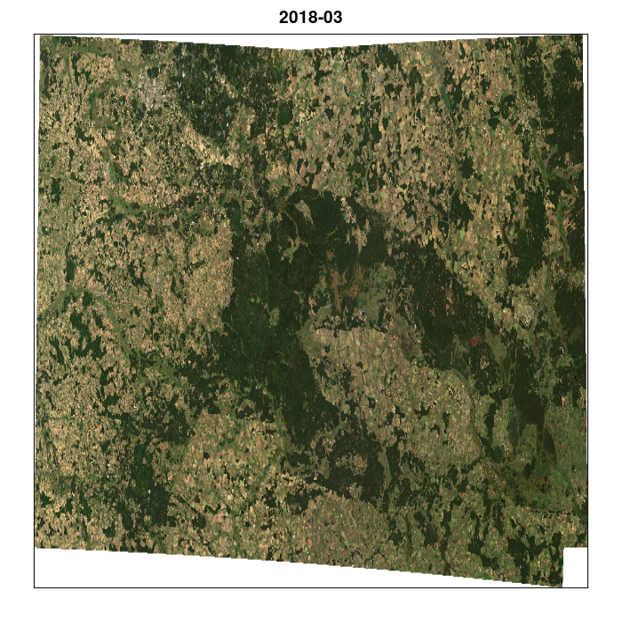
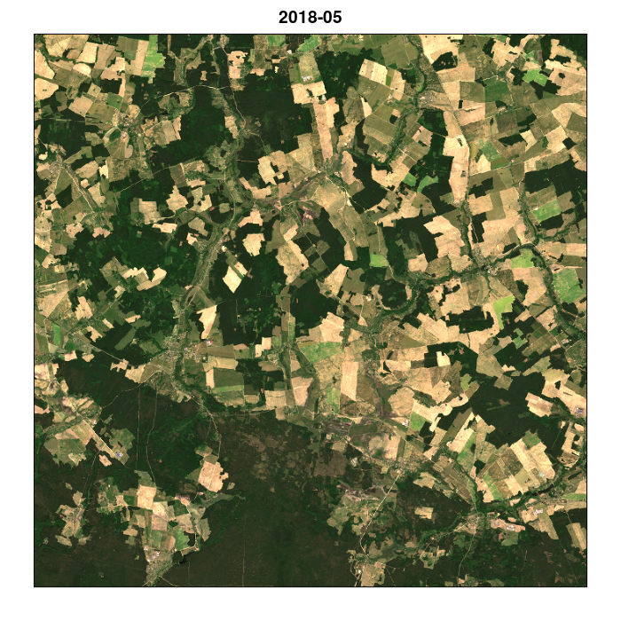
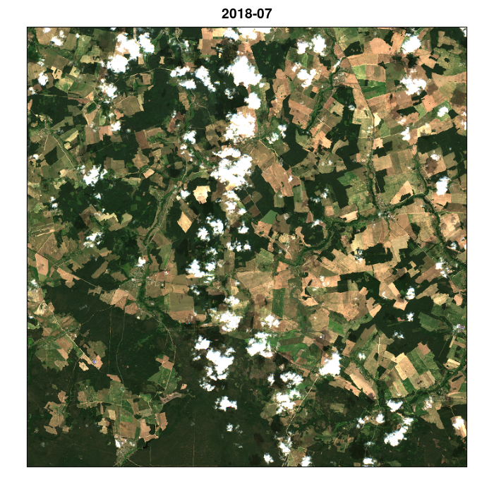
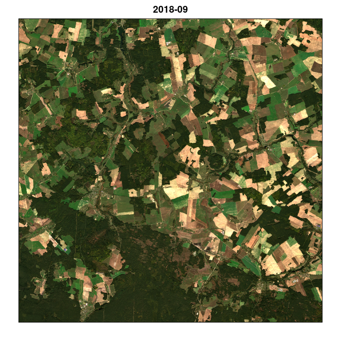
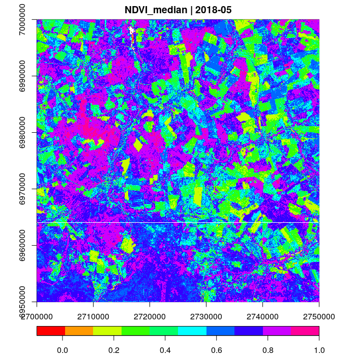
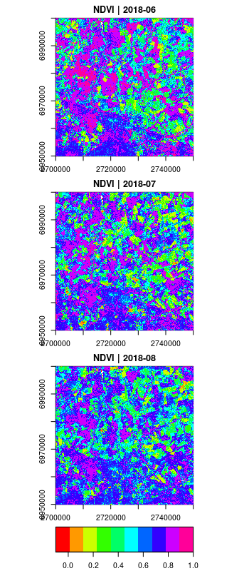
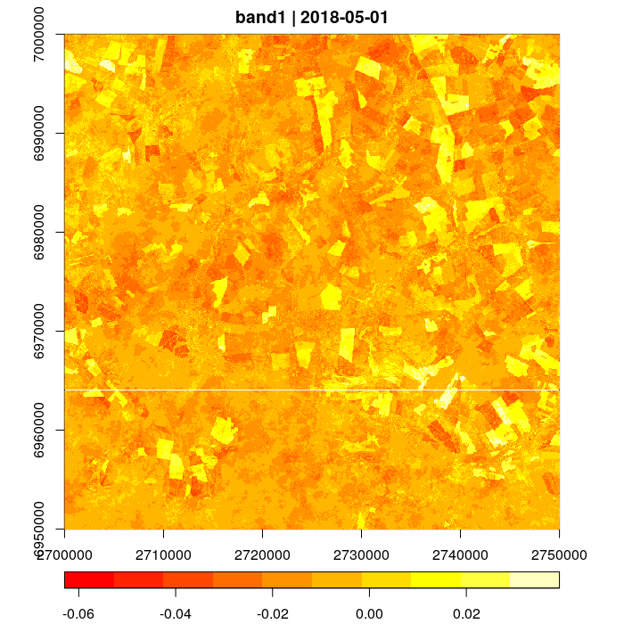

## Preface

This tutorial will demonstrate how Sentinel 2 time series can be processed
with the gdalcubes R package. We will use 102 Sentinel 2 Level 2A images
from three different tiles, covering the European [Białowieża Forest](https://en.wikipedia.org/wiki/Bia%C5%82owie%C5%BCa_Forest) from
March to November 2018.


We assume that you have successfully installed the R package. If not, please 
follow the instructions at [GitHub](https://github.com/appelmar/gdalcubes_R).
Due to the data size, we do not provide the data along with this document. However,
you should be able to run the commands by downloading the same data from the [Copernicus Open Access Hub](https://scihub.copernicus.eu/) on your own, 
or by putting any other Sentinel 2 Level 2A(!) images to the current working directory.

Time measurements refer to a personal laptop equipped with a quite powerful quad-core CPU where images are stored on an exernal SSD and up to 8 threads are used to process the data cubes. 

## Getting started


As a first step, we load the package with `library(gdalcubes)`, which also loads required packages and prints some version information. 

```
> library(gdalcubes)
## Loading required package: Rcpp
## Loading required package: RcppProgress
## Loading required package: jsonlite
## Loading required package: ncdf4
## Using gdalcubes library version 0.0.1 (78122403dc09d91994b2cefe86bec23b40ad115b)
```

The Sentinel 2 images are stored as original ZIP archives at the current working directory.
We process the archive files directly without unzipping through [GDAL's virtual file system vsizip](https://www.gdal.org/gdal_virtual_file_systems.html#gdal_virtual_file_systems_vsizip).
The following command prints a list of available files.

```
> list.files(pattern=".zip")
##  [1] "S2A_MSIL2A_20180328T093031_N0207_R136_T34UFD_20180328T145945.zip" "S2A_MSIL2A_20180407T093031_N0207_R136_T34UFD_20180407T104459.zip"
##  [3] "S2A_MSIL2A_20180407T093031_N0207_R136_T34UGD_20180407T104459.zip" "S2A_MSIL2A_20180407T093031_N0207_R136_T35ULU_20180407T104459.zip"
##  [5] "S2A_MSIL2A_20180410T094031_N0207_R036_T34UFD_20180410T114924.zip" "S2A_MSIL2A_20180410T094031_N0207_R036_T34UGD_20180410T114924.zip"
##  [7] "S2A_MSIL2A_20180410T094031_N0207_R036_T35ULU_20180410T114924.zip" "S2A_MSIL2A_20180420T094031_N0207_R036_T34UFD_20180420T101451.zip"
##  [9] "S2A_MSIL2A_20180420T094031_N0207_R036_T34UGD_20180420T101451.zip" "S2A_MSIL2A_20180420T094031_N0207_R036_T35ULU_20180420T101451.zip"
## [11] "S2A_MSIL2A_20180430T094031_N0207_R036_T34UFD_20180430T114456.zip" "S2A_MSIL2A_20180430T094031_N0207_R036_T34UFD_20180430T132616.zip"
## [13] "S2A_MSIL2A_20180430T094031_N0207_R036_T34UGD_20180430T114456.zip" "S2A_MSIL2A_20180430T094031_N0207_R036_T35ULU_20180430T114456.zip"
## [15] "S2A_MSIL2A_20180430T094031_N0207_R036_T35ULU_20180430T132616.zip" "S2A_MSIL2A_20180507T093041_N0207_R136_T34UFD_20180507T114155.zip"
## [17] "S2A_MSIL2A_20180507T093041_N0207_R136_T34UGD_20180507T114155.zip" "S2A_MSIL2A_20180507T093041_N0207_R136_T35ULU_20180507T114155.zip"
## [19] "S2A_MSIL2A_20180510T094031_N0207_R036_T34UFD_20180510T114819.zip" "S2A_MSIL2A_20180510T094031_N0207_R036_T34UGD_20180510T114819.zip"
## [21] "S2A_MSIL2A_20180510T094031_N0207_R036_T35ULU_20180510T114819.zip" "S2A_MSIL2A_20180520T094031_N0207_R036_T34UFD_20180520T100921.zip"
## [23] "S2A_MSIL2A_20180520T094031_N0207_R036_T34UGD_20180520T100921.zip" "S2A_MSIL2A_20180520T094031_N0207_R036_T35ULU_20180520T100921.zip"
## [25] "S2A_MSIL2A_20180527T093041_N0208_R136_T34UFD_20180527T121043.zip" "S2A_MSIL2A_20180527T093041_N0208_R136_T34UGD_20180527T121043.zip"
## [27] "S2A_MSIL2A_20180527T093041_N0208_R136_T35ULU_20180527T121043.zip" "S2A_MSIL2A_20180530T094031_N0208_R036_T34UFD_20180530T122531.zip"
## [29] "S2A_MSIL2A_20180530T094031_N0208_R036_T34UGD_20180530T122531.zip" "S2A_MSIL2A_20180530T094031_N0208_R036_T35ULU_20180530T122531.zip"
## [31] "S2A_MSIL2A_20180606T093031_N0208_R136_T34UFD_20180606T140856.zip" "S2A_MSIL2A_20180609T094031_N0208_R036_T34UFD_20180609T111936.zip"
## [33] "S2A_MSIL2A_20180609T094031_N0208_R036_T34UGD_20180609T111936.zip" "S2A_MSIL2A_20180609T094031_N0208_R036_T35ULU_20180609T111936.zip"
## [35] "S2A_MSIL2A_20180629T094031_N0208_R036_T34UFD_20180629T121612.zip" "S2A_MSIL2A_20180706T093041_N0208_R136_T34UFD_20180706T121907.zip"
## [37] "S2A_MSIL2A_20180706T093041_N0208_R136_T34UGD_20180706T121907.zip" "S2A_MSIL2A_20180706T093041_N0208_R136_T35ULU_20180706T121907.zip"
## [39] "S2A_MSIL2A_20180709T094031_N0208_R036_T34UFD_20180709T121340.zip" "S2A_MSIL2A_20180709T094031_N0208_R036_T34UFD_20180709T122246.zip"
## [41] "S2A_MSIL2A_20180719T094031_N0208_R036_T34UFD_20180719T123605.zip" "S2A_MSIL2A_20180719T094031_N0208_R036_T34UGD_20180719T123605.zip"
## [43] "S2A_MSIL2A_20180719T094031_N0208_R036_T35ULU_20180719T123605.zip" "S2A_MSIL2A_20180808T094031_N0208_R036_T34UFD_20180808T123512.zip"
## [45] "S2A_MSIL2A_20180808T094031_N0208_R036_T34UGD_20180808T123512.zip" "S2A_MSIL2A_20180808T094031_N0208_R036_T35ULU_20180808T123512.zip"
## [47] "S2A_MSIL2A_20180818T094031_N0208_R036_T34UFD_20180818T120345.zip" "S2A_MSIL2A_20180818T094031_N0208_R036_T34UGD_20180818T120345.zip"
## [49] "S2A_MSIL2A_20180818T094031_N0208_R036_T35ULU_20180818T120345.zip" "S2A_MSIL2A_20181014T093031_N0209_R136_T34UFD_20181014T111722.zip"
## [51] "S2A_MSIL2A_20181014T093031_N0209_R136_T34UGD_20181014T111722.zip" "S2A_MSIL2A_20181014T093031_N0209_R136_T35ULU_20181014T111722.zip"
## [53] "S2A_MSIL2A_20181017T094011_N0209_R036_T34UFD_20181017T115053.zip" "S2A_MSIL2A_20181017T094011_N0209_R036_T34UGD_20181017T115053.zip"
## [55] "S2A_MSIL2A_20181017T094011_N0209_R036_T35ULU_20181017T115053.zip" "S2B_MSIL2A_20180326T094029_N0207_R036_T34UGD_20180326T114246.zip"
## [57] "S2B_MSIL2A_20180326T094029_N0207_R036_T35ULU_20180326T114246.zip" "S2B_MSIL2A_20180412T093029_N0207_R136_T34UFD_20180412T122815.zip"
## [59] "S2B_MSIL2A_20180412T093029_N0207_R136_T34UGD_20180412T122815.zip" "S2B_MSIL2A_20180412T093029_N0207_R136_T35ULU_20180412T122815.zip"
## [61] "S2B_MSIL2A_20180505T094029_N0207_R036_T34UGD_20180505T115132.zip" "S2B_MSIL2A_20180505T094029_N0207_R036_T35ULU_20180505T115132.zip"
## [63] "S2B_MSIL2A_20180512T093029_N0207_R136_T34UFD_20180512T131132.zip" "S2B_MSIL2A_20180512T093029_N0207_R136_T34UGD_20180512T131132.zip"
## [65] "S2B_MSIL2A_20180512T093029_N0207_R136_T35ULU_20180512T131132.zip" "S2B_MSIL2A_20180515T094029_N0207_R036_T34UFD_20180515T114639.zip"
## [67] "S2B_MSIL2A_20180515T094029_N0207_R036_T34UGD_20180515T114639.zip" "S2B_MSIL2A_20180515T094029_N0207_R036_T35ULU_20180515T114639.zip"
## [69] "S2B_MSIL2A_20180522T093029_N0207_R136_T34UFD_20180522T121543.zip" "S2B_MSIL2A_20180601T093029_N0208_R136_T34UFD_20180601T111648.zip"
## [71] "S2B_MSIL2A_20180601T093029_N0208_R136_T34UGD_20180601T111648.zip" "S2B_MSIL2A_20180601T093029_N0208_R136_T35ULU_20180601T111648.zip"
## [73] "S2B_MSIL2A_20180604T094029_N0208_R036_T34UFD_20180604T135858.zip" "S2B_MSIL2A_20180604T094029_N0208_R036_T34UGD_20180604T135858.zip"
## [75] "S2B_MSIL2A_20180604T094029_N0208_R036_T35ULU_20180604T135858.zip" "S2B_MSIL2A_20180731T093029_N0208_R136_T34UGD_20180731T120012.zip"
## [77] "S2B_MSIL2A_20180731T093029_N0208_R136_T35ULU_20180731T120012.zip" "S2B_MSIL2A_20180803T094029_N0208_R036_T34UFD_20180803T141742.zip"
## [79] "S2B_MSIL2A_20180810T093029_N0208_R136_T34UFD_20180810T121904.zip" "S2B_MSIL2A_20180810T093029_N0208_R136_T34UGD_20180810T121904.zip"
## [81] "S2B_MSIL2A_20180810T093029_N0208_R136_T35ULU_20180810T121904.zip" "S2B_MSIL2A_20180813T094029_N0208_R036_T34UGD_20180813T152841.zip"
## [83] "S2B_MSIL2A_20180813T094029_N0208_R036_T35ULU_20180813T152841.zip" "S2B_MSIL2A_20180820T093029_N0208_R136_T34UFD_20180820T120528.zip"
## [85] "S2B_MSIL2A_20180820T093029_N0208_R136_T34UGD_20180820T120528.zip" "S2B_MSIL2A_20180820T093029_N0208_R136_T35ULU_20180820T120528.zip"
## [87] "S2B_MSIL2A_20180823T094029_N0208_R036_T34UFD_20180823T122014.zip" "S2B_MSIL2A_20180823T094029_N0208_R036_T34UGD_20180823T122014.zip"
## [89] "S2B_MSIL2A_20180823T094029_N0208_R036_T35ULU_20180823T122014.zip" "S2B_MSIL2A_20180830T093029_N0208_R136_T34UFD_20180830T120453.zip"
## [91] "S2B_MSIL2A_20180830T093029_N0208_R136_T34UGD_20180830T120453.zip" "S2B_MSIL2A_20180830T093029_N0208_R136_T35ULU_20180830T120453.zip"
## [93] "S2B_MSIL2A_20180929T093029_N0208_R136_T34UFD_20180929T140703.zip" "S2B_MSIL2A_20181009T093029_N0209_R136_T34UGD_20181009T122235.zip"
## [95] "S2B_MSIL2A_20181009T093029_N0209_R136_T35ULU_20181009T122235.zip" "S2B_MSIL2A_20181012T094029_N0209_R036_T34UFD_20181012T145646.zip"
## [97] "S2B_MSIL2A_20181012T094029_N0209_R036_T34UGD_20181012T145646.zip" "S2B_MSIL2A_20181012T094029_N0209_R036_T35ULU_20181012T145646.zip"
## [99] "S2B_MSIL2A_20181019T093029_N0209_R136_T34UGD_20181019T123600.zip" "S2B_MSIL2A_20181019T093029_N0209_R136_T35ULU_20181019T123600.zip"
##[101] "S2B_MSIL2A_20181108T093209_N0210_R136_T34UGD_20181108T125929.zip" "S2B_MSIL2A_20181108T093209_N0210_R136_T35ULU_20181108T125929.zip"
```

That gives us 102 images, amounting to approximately 90 GB.

```
> sum(file.size(list.files(pattern="*.zip"))) / 1000^3
## [1] 90.2587
```

As described above, the data come from 3 different tiles (T34UFD, T34UGD, and T35ULU) that include different UTM Zones (34N and 35N). Images also come from both 
operating satellites S2A and S2B.


## Creating an image collection from local files

As a first step, we must index these files in an image collection by deriving the aquisition date / time, the spatial extent, the spatial reference system,
and which files belong to which spectral bands. This is what `create_image_collection()` does. We provide a vector of files, a collection format that defines
how the information above can be extracted from images and an output file, where the image collection index is stored. The output file is 
a simple [SQLite](https://www.sqlite.org) database referencing the provided files and the extracted metadata.  Notice that gdalcubes comes with a set of predefined collection formats. You can call `collection_formats()` to print available formats.
The following command will scan all files and create an image collection that is stored as `S2_timeseries.db`. This file will include only
references and metadata but not the imagery. 


```
> create_image_collection(list.files(pattern="*.zip", full.names = TRUE), 
                          format="Sentinel2_L2A", unroll_archives=TRUE, out_file="S2_timeseries.db") 

## A GDAL image collection object, referencing 102 images with 12  bands
## Images:
##                                                           name     left      top   bottom    right            datetime
## 1 S2A_MSIL2A_20180328T093031_N0207_R136_T34UFD_20180328T145945 22.46498 53.24021 52.22257 24.14177 2018-03-28T09:30:31
## 2 S2A_MSIL2A_20180407T093031_N0207_R136_T34UFD_20180407T104459 22.46498 53.24021 52.22257 24.14177 2018-04-07T09:30:31
## 3 S2A_MSIL2A_20180407T093031_N0207_R136_T34UGD_20180407T104459 23.92782 53.21199 52.17549 25.63418 2018-04-07T09:30:31
## 4 S2A_MSIL2A_20180407T093031_N0207_R136_T35ULU_20180407T104459 24.00476 53.24196 52.22621 25.67854 2018-04-07T09:30:31
## 5 S2A_MSIL2A_20180410T094031_N0207_R036_T34UFD_20180410T114924 22.46498 53.24021 52.22257 24.14177 2018-04-10T09:40:31
## 6 S2A_MSIL2A_20180410T094031_N0207_R036_T34UGD_20180410T114924 23.92782 53.21199 52.17549 25.63418 2018-04-10T09:40:31
##                                                proj
## 1 +proj=utm +zone=34 +datum=WGS84 +units=m +no_defs 
## 2 +proj=utm +zone=34 +datum=WGS84 +units=m +no_defs 
## 3 +proj=utm +zone=34 +datum=WGS84 +units=m +no_defs 
## 4 +proj=utm +zone=35 +datum=WGS84 +units=m +no_defs 
## 5 +proj=utm +zone=34 +datum=WGS84 +units=m +no_defs 
## 6 +proj=utm +zone=34 +datum=WGS84 +units=m +no_defs 
## 
## Bands:
##    name type offset scale unit   nodata
## 1   B01    2      0     1      0.000000
## 2   B02    2      0     1      0.000000
## 3   B03    2      0     1      0.000000
## 4   B04    2      0     1      0.000000
## 5   B05    2      0     1      0.000000
## 6   B06    2      0     1      0.000000
## 7   B07    2      0     1      0.000000
## 8   B08    2      0     1      0.000000
## 9   B09    2      0     1      0.000000
## 10  B11    2      0     1      0.000000
## 11  B12    2      0     1      0.000000
## 12  B8A    2      0     1      0.000000   

> file.size("S2_timeseries.db") / 1000
## [1] 438.272  
```

Notice that only the first six images are printed by `create_image_collection()`. Setting `unroll_archives=TRUE` makes sure that we automatically scan the content of ZIP files using [GDAL's virtual file systems](https://www.gdal.org/gdal_virtual_file_systems.html).
The image collection file takes around 0.5 MB on disk.


## Creating a data cube and deriving a true color preview image

Unfortunately, raw image collections are hard to work with: Images overlap, come in different map projections, and have irregular temporal
sampling. gdalcubes creates regular data cubes (multidimensional arrays) from image collections by cropping, resampling, and reprojecting images
on-the-fly with regard to a previously defined cube. The shape of the cube is defined in a _data cube view_, containing the spatiotemporal extent, resolution, and spatial reference system.
We can thus use the same image collection and process it at different resolutions, and extents. This makes working with EO imagery much easier and interactive as we can try out
our computations at lower resolution first. This also hides some of the ugly details with EO data such as different resolutions for different spectral bands. 
In theory, we could define a cm resolution cube for Sentinel 2 data and gdalcubes will not complain.

In the following example, we load the image collection and first create a default cube with `data_cube()`, without specifying a data cube view manually.
This gives us a low resolution overview, covering the full spatiotemporal extent of the input image collection. We use this default
view and modify it later by overwriting the temporal size of pixels and the number of pixels in y and x directions with `cube_view()`. This function
can be used to

1. extract the view of a data cube by providing the argument `cube`,
2. overwriting parameters of an existing data cube view (by providing the argument `view` and one or more of the view parameters),
3. or to define a manual data cube view by only providing data cube parameters. 

Afterwards, we use `select_bands()` to select a subset of the original bands, `reduce()` to apply a median reduce over 
all pixel time series and finally plot the result as am RGB image.

```
> s2.col = image_collection("S2_timeseries.db")
> v = cube_view(data_cube(s2.col))
> v
## $space
## $space$right
## [1] 2858522
## 
## $space$left
## [1] 2500790
## 
## $space$top
## [1] 7027881
## 
## $space$bottom
## [1] 6831918
## 
## $space$nx
## [1] 691
## 
## $space$ny
## [1] 378
## 
## $space$proj
## [1] "EPSG:3857"
## 
## $space$dx
## NULL
## 
## $space$dy
## NULL
## 
## 
## $time
## $time$t0
## [1] "2018-03"
## 
## $time$t1
## [1] "2019-02"
## 
## $time$dt
## [1] "P3M"
## 
## $time$nt
## NULL
## 
## 
## $aggregation
## [1] "first"
## 
## $resampling
## [1] "near"
## 
## attr(,"class")
## [1] "cube_view" "list"
     
> v = cube_view(view=v, dt="P1M", nx=1000, ny=round(0.5477928*1000))
> s2.cube = data_cube(s2.col, v)
> s2.cube
## A GDAL data cube proxy object
## Dimensions:
##   name     low    high size chunk_size
## 1    t  201803  201902   12         16
## 2    y 6831918 7027881  548        256
## 3    x 2500790 2858522 1000        256
## 
## Bands:
##    name offset scale nodata unit
## 1   B01      0     1    NaN     
## 2   B02      0     1    NaN     
## 3   B03      0     1    NaN     
## 4   B04      0     1    NaN     
## 5   B05      0     1    NaN     
## 6   B06      0     1    NaN     
## 7   B07      0     1    NaN     
## 8   B08      0     1    NaN     
## 9   B09      0     1    NaN     
## 10  B11      0     1    NaN     
## 11  B12      0     1    NaN     
## 12  B8A      0     1    NaN     

> gdalcubes_set_threads(8)
> s2.cube.rgb = select_bands(s2.cube, c("B02", "B03", "B04"))
> s2.cube.rgb
## A GDAL data cube proxy object
## Dimensions:
##   name     low    high size chunk_size
## 1    t  201803  201902   12         16
## 2    y 6831918 7027881  548        256
## 3    x 2500790 2858522 1000        256
## 
## Bands:
##   name offset scale nodata unit
## 1  B02      0     1    NaN     
## 2  B03      0     1    NaN     
## 3  B04      0     1    NaN     

> s2.cube.reduced = reduce(s2.cube.rgb, "median")
> s2.cube.reduced 
## A GDAL data cube proxy object
## Dimensions:
##   name     low    high size chunk_size
## 1    t  201803  201803    1          1
## 2    y 6831918 7027881  548        256
## 3    x 2500790 2858522 1000        256
## 
## Bands:
##         name offset scale nodata unit
## 1 B02_median      0     1    NaN     
## 2 B03_median      0     1    NaN     ub
## 3 B04_median      0     1    NaN     

> system.time(plot(s2.cube.reduced, rgb=3:1, zlim=c(0,1800)))
## 0%   10   20   30   40   50   60   70   80   90   100%
## [----|----|----|----|----|----|----|----|----|----|
## **************************************************|
## 
##    user  system elapsed 
## 132.478  42.987 115.177 
```





The package works with so called _proxy objects_. Creating a data cube with `data_cube()` or any of the cube operations such as `reduce()` and
`select_bands()`  will not read any data from images. Instead, it will only derive the shape
of the output cube and print some metadata. In this example, calling `plot()` will start doing the actual processing.

We can also write the same operation chain with the [pipe operator %>%](https://magrittr.tidyverse.org/).

```
> require(magrittr)
> data_cube(s2.col, v) %>%
>   select_bands(c("B02", "B03", "B04")) %>%
>   reduce("median") %>%
>   plot(rgb=3:1, zlim=c(0,1800))
```

The data is cropped, resampled, and reprojected on-the-fly, meaning that we can apply the same functions as above but simply 
use a different data cube view to create a cloud free image of a small spatiotemporal subset at higher resolution. The code below 
creates three different views of the same spatial area but different temporal extents and applies the median reduce over the RGB bands.


```
> v1 = cube_view(proj="EPSG:3857", view=v, t0="2018-05",t1="2018-06", 
>               l=2700000, r=2750000, t=7000000, b=6950000, nx=700, ny=700) # 50x50 km subset
> system.time(data_cube(s2.col, v) %>%
>   select_bands(c("B02", "B03", "B04")) %>%
>   reduce("median") %>%
>   plot(rgb=3:1, zlim=c(0,1800)))

## 0%   10   20   30   40   50   60   70   80   90   100%
## [----|----|----|----|----|----|----|----|----|----|
## **************************************************|
##
##   user  system elapsed 
## 42.865   1.470   8.189

> data_cube(s2.col, cube_view(view=v1, t0="2018-07", t1="2018-08")) %>%
>      select_bands(c("B02", "B03", "B04")) %>%
>      reduce("median") %>%
>      plot(rgb=3:1, zlim=c(0,1800))

## 0%   10   20   30   40   50   60   70   80   90   100%
## [----|----|----|----|----|----|----|----|----|----|
## **************************************************|


> data_cube(s2.col, cube_view(v1, t0="2018-09", t1="2018-010")) %>%
>   select_bands(c("B02", "B03", "B04")) %>%
>   reduce("median") %>%
>   plot(rgb=3:1, zlim=c(0,1800)))

## 0%   10   20   30   40   50   60   70   80   90   100%
## [----|----|----|----|----|----|----|----|----|----|
## **************************************************|
```








## Pixel-wise calculations

gdalcubes supports the calculation of basic arithmetic expressions per pixel in `apply_pixel()`. The function takes an
input data cube and a character vector as input, where items are simple expressions on band names of the input cube. Each expression
becomes a new band in the output cube where band names default to "band1", "band2", etc. A third argument `names` can be set
to define meaningful band names. `names` must be a character vector with the same length as the expression vector.
In the example below, we compute the NDVI using the expression `(B08-B04)/(B08+B04)`.

```
> system.time(data_cube(s2.col, v1) %>%
>   select_bands(c("B04", "B08")) %>%
>   apply_pixel("(B08-B04)/(B08+B04)", "NDVI") %>%
>   reduce("median") %>%
>   plot(zlim=c(-0.1,1), col=rainbow, key.pos=1))
  
## 0%   10   20   30   40   50   60   70   80   90   100%
## [----|----|----|----|----|----|----|----|----|----|
## **************************************************|
## 
##    user  system elapsed 
##  30.367   1.190   6.009   
```



So far, we have only plotted cubes after a reduction. However, we can also plot a time series by not applying a reducer, and even
a multi-band time-series (not shown here). However, depending on the number of time steps and bands, plots can quickly become unreadable.

```
> v = cube_view(proj="EPSG:3857", view=v, t0="2018-06",t1="2018-08",
>               l=2700000, r=2750000, t=7000000, b=6950000, nx=700, ny=700, 
>               aggregation = "median")
> system.time(data_cube(s2.col, v) %>%
>     select_bands(c("B04", "B08")) %>%
>     apply_pixel("(B08-B04)/(B08+B04)", "NDVI") %>%
>     plot(zlim=c(-0.1,1), col=rainbow, key.pos=1))

## 0%   10   20   30   40   50   60   70   80   90   100%
## [----|----|----|----|----|----|----|----|----|----|
## **************************************************|
## 
##   user  system elapsed 
## 38.053   1.318   7.917
```




## Applying R functions to data cube chunks

Though gdalcubes comes with very few operations to process data cubes, it is possible to apply arbitrary R functions to
the chunks of a data cube. Chunks are smaller sub-cubes that are loaded to main memory when a data cube is read. 
The size of chunks can be specified as an optional argument `chunking` to `data_cube()`. This is a vector with three integers
for the number of pixels in the dimensions t, y, and x. By default, a chunk includes 16x256x256 pixels. 
If operations such as a reduction are applied to a cube, the chunk size of the result might change. 

In the example below, we create a 5-daily time series for the spatial subset from June to September 2018, fit a regression line through
all pixel NDVI time-series and finally return (and plot) the slope of the fitted line. This should give us a rough idea about the 
trend of the NDVI.

```
> v = cube_view(proj="EPSG:3857", view=v, t0="2018-05-01",t1="2018-09-30", dt="P5D",  
>               l=2700000, r=2750000, t=7000000, b=6950000, nx=700, ny=700)
>
> f <- function() {
>   x = read_stream_as_array()
>   out <- reduce_time(x, function(x) {
>     n = sum(!is.na(x[1,]))
>     if (n < 3) {
>       return(NA)
>     }
>     y = data.frame(z = x[1,], t=1:length(x[1,]))
>     return(coef(lm(z ~ t, y))[2])
>   })
>   write_stream_from_array(out)
> }
>
> data_cube(s2.col, v, chunking = c(365, 256, 256)) %>%
>   select_bands(c("B04", "B08")) %>%
>   apply_pixel("(B08-B04)/(B08+B04)", "NDVI") %>%
>   chunk_apply(f) %>% 
>   plot(key.pos=1, col=heat.colors)

## 0%   10   20   30   40   50   60   70   80   90   100%
## [----|----|----|----|----|----|----|----|----|----|
## **************************************************|
```




The function provided to `chunk_apply()` should **always** start with `x = read_stream_as_array()` and end with `write_stream_from_array(out)`.
The former function reads the data of the current chunk as a four-dimensional R array with dimensions bands, time, y, x and the latter writes 
the results from a four-dimensional R array to the internal gdalcubes chunk buffer. Internally, this function is quite complex because
the gdalcubes library does not only target R. The function uses so called _chunk streaming_ by calling an external process (the Rscript executable in this case) and streaming
data to [stdin](https://en.wikipedia.org/wiki/Standard_streams) and reading data from [stdout](https://en.wikipedia.org/wiki/Standard_streams) of these processes.


## What's next?

Though this example demonstrates how to process around 90GB of Sentinel 2 imagery, processing larger amounts of images locally will eventually fail and at some point we must move to the cloud. 
gdalcubes in principal can be used in the cloud by referencing e.g. S3 buckets with Sentinel imagery but this has not been tried and documented. Using `gdalcubes_server` it should also be possible to run everything even in distributed cloud environments, e.g., with [Docker](https://docs.docker.com) und [Kubernetes](https://kubernetes.io).
We see a lot of things that could be done in this regard but this is all still to be done in the future.

At the moment, gdalcubes includes only very few operations to process data cubes. For instance, reduction over space and moving window operations are not yet implemented. 
The `plot()` functions also certainly needs some improvement, e.g., to plot simple time series or to change the plot layouts for multi-spectral and multi-temporal cubes.


